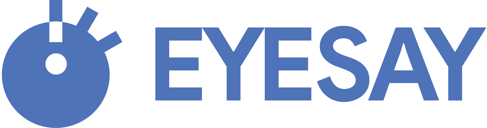
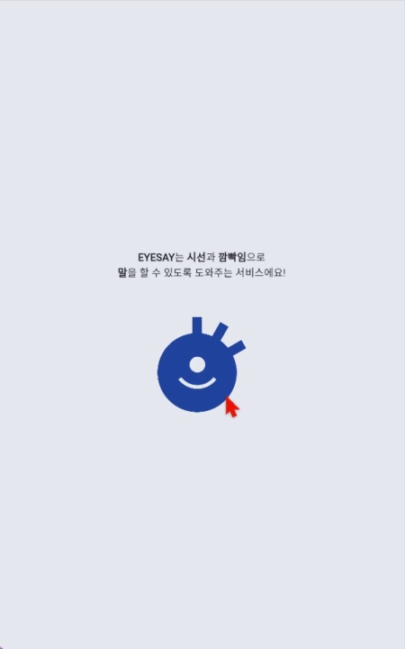
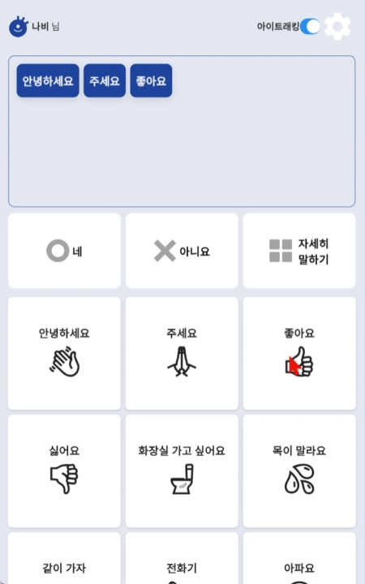
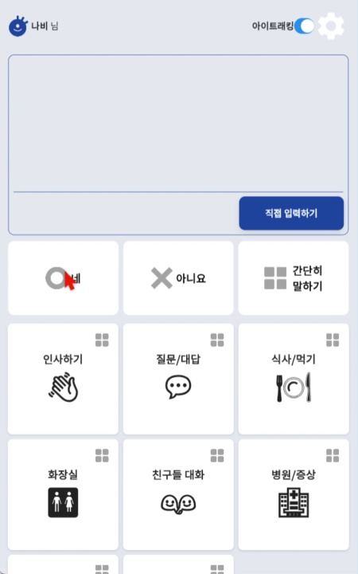
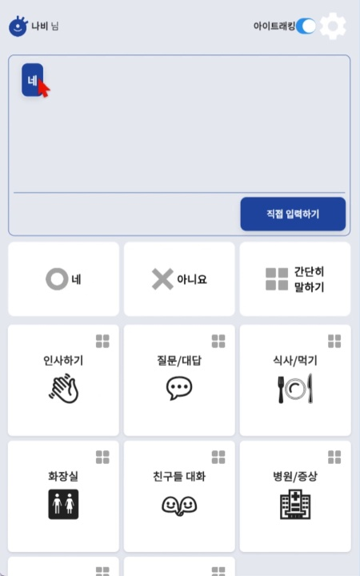

# EYESAY

2024 Solution Challenge - GDSC KU

## Problems
Many people with disablities have difficulty in communication. However, everyone, regardless of disability, should be able to communicate.

This is because communication difficulties extend beyond mere daily inconveniences; they limit participation in society, pose barriers to accessing healthcare services, and increase vulnerability to crime.

## UN SDGs
   

## Solution

### Communication With Word Cards
This feature enhances the user's ability to express themselves with word cards, group cards, keyboard input.

- Word Card Selection: Users can choose from an array of word cards to form sentences.
- Grouped Card Choices: Cards are organized into groups for easier navigation and selection, allowing for quicker construction of phrases.
- Direct Keyboard Input: Direct keyboard input is also supported, offering flexibility in communication methods.
- Frequently Used Words: The system dynamically adapts to include words and phrases that are frequently used by the user, personalizing the experience.
- Card Recommendation: Upon selecting a card, the system intelligently recommends the next card to facilitate smooth and efficient expression construction.
- Voice Conversion with TTS: After completing an expression, the text can be converted into speech through Text-To-Speech technology, enabling verbal communication.

### Eye-Tracking
Our platform uses eye-tracking, offering an innovative and accessible way for users to interact with the application.

- Pre-Trained Eye-Tracking Datasets: The model is pre-trained with eye-gaze datasets, ensuring accurate and responsive eye-tracking functionality.
- Personalized Eye-Tracking Learning: On-device learning adapts to the individual's eye-gaze patterns, enhancing accuracy and personalization.
  - Focus Adjustment: At the start of the app, users are guided through a focus adjustment process. This calibration ensures that the eye-tracking system is finely tuned to the user's specific gaze behavior, optimizing the interaction experience.
- Looky, The Eye-Tracking Character: A marker called Looky is at these coordinates to indicate where the user is looking.

## Stack
- Flutter
- Tensorflow + Keras

## Prototype

1. Focus setting

 

2. Say with a word card, Say with a group card

  

## Expected Effects
The ultimate goal of this project is to facilitate a society where communication is accessible to all, regardless of disability. Our focus has been particularly on those who cannot easily utilize standard communication devices due to disabilities. Through the development of an eye-tracking communication method, we aim to assist them in engaging freely with society.

In the case of individuals with ALS, there exists a method of communication where a caregiver points to letters and the individual blinks to indicate their choice. This project digitalizes such communication methods, offering a faster and more direct form of interaction.

EYESAY supports the right of individuals with disabilities to express themselves freely and dreams of a society where everyone, regardless of disability, can communicate freely.

## Demo Video